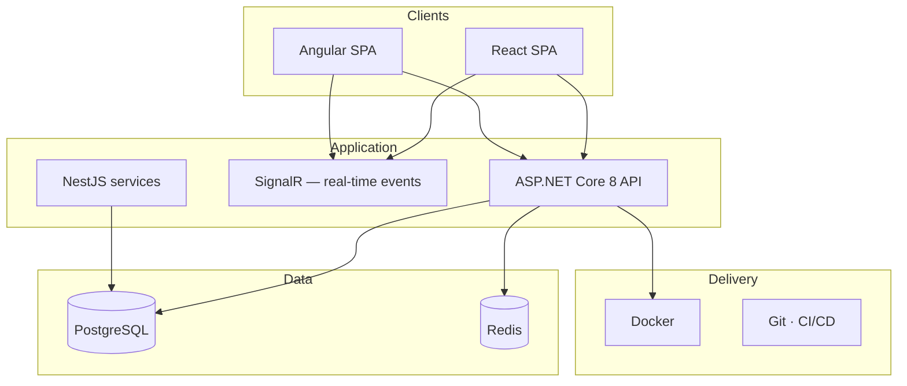

<div align="center">


<br>

[](https://git.io/typing-svg)

<br>

[](https://github.com/Kishoyian-Brian)
[](https://github.com/Kishoyian-Brian)

<br>

*I design, build, and ship production systems — from API design and data models to deployed UIs.*

<br>


</div>

<br>

## Overview

Fullstack developer focused on **business-critical software** — venue operations, point-of-sale, and real-time workflows. I work across the stack with a bias toward **clean architecture**, clear boundaries, and code that teams can own long after launch.

<br>

## How I work

```md
# ~/engineering/PRINCIPLES.md

1. Production over prototypes — I ship software used in real operations.
2. Architecture first — bounded contexts, explicit contracts, sensible defaults.
3. Automate the repeatable — tooling and CI so the team moves faster, not just me.
4. Own the full path — design, implementation, data layer, and deployment.
```

<br>

## Systems I build



<br>

## Expertise

| Layer | Technologies |
|:------|:-------------|
| **Frontend** | Angular · React · Next.js · TypeScript · HTML · CSS · Sass · Vite |
| **Backend** | ASP.NET Core · Node.js · NestJS · Prisma |
| **Data** | PostgreSQL · Redis |
| **Platform** | Docker · Git |

<div align="center">


</div>

<br>

---

<br>

<div align="center">

<table>
  <tr>
    <td>
      <a href="https://github.com/Kishoyian-Brian">
        
      </a>
    </td>
    <td>
      <a href="https://github.com/Kishoyian-Brian">
        
      </a>
    </td>
  </tr>
</table>

<br>

[](https://git.io/streak-stats)

</div>

<br>

---

<br>

## Contact

Open to **freelance contracts**, **full-time roles**, and **technical collaborations**.

<div align="center">

[](mailto:brianmwasbayo@gmail.com)
[](https://www.linkedin.com/in/brian-mwangi-a081a1330/)
[](https://github.com/Kishoyian-Brian)

</div>
